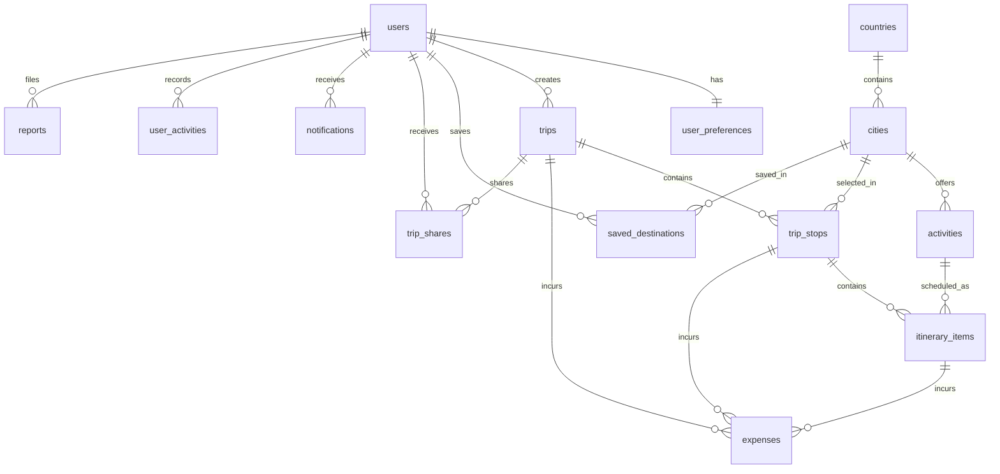

# GlobeTrotter Database Architecture

## Engine & Infrastructure
- **RDBMS**: PostgreSQL 14+
- **ORM**: SQLAlchemy 2.x
- **Migration Tool**: Alembic
- **Primary Keys**: UUID (v4)

## Entity Relationship Diagram

## Table Specifications

### 1. `users`
- Stores registered user credentials, profile information, and system roles (`is_admin`).

### 2. `user_preferences`
- User configuration settings including currency, language, notification toggles, and theme.

### 3. `countries`
- Master catalog of 149 offline countries with ISO codes, capitals, currencies, and coordinates.

### 4. `cities`
- Catalog of 608 destination cities mapped to countries with cost indices and popularity scores.

### 5. `activities`
- 2,432 tourist activities categorized by type with estimated costs and durations.

### 6. `trips`
- Travel trip records owned by users with date ranges, budget limits, and visibility permissions.

### 7. `trip_stops`
- Destination stops assigned to trips with ordering and budget allocations.

### 8. `itinerary_items`
- Scheduled activities within destination stops with times and order numbers.

### 9. `expenses`
- Logged financial transactions categorized by spend type (Stay, Transport, Activity, Food).

### 10. `saved_destinations`
- Bookmarked cities saved by users for future planning.

### 11. `trip_shares`
- Access control list for shared public/private trip access tokens.

### 12. `notifications`
- System and activity notifications for users.

### 13. `user_activities`
- Audit log of user platform actions.

### 14. `reports`
- Flagged content and moderation reports resolved by administrators.
