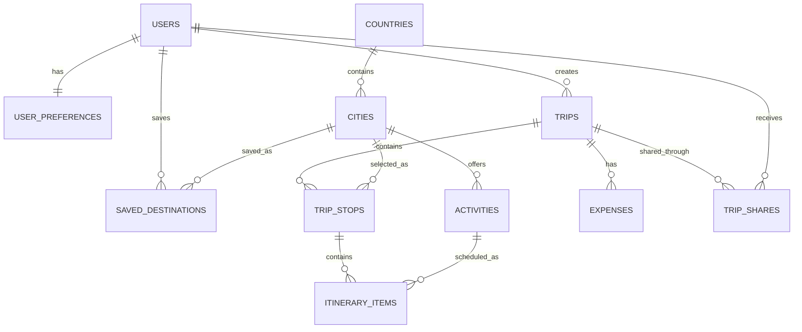

# ✈️ Globe Trotter

> **Simplify complex travel planning through an interactive, visual, and budget-smart journey builder.**

[](https://fastapi.tiangolo.com/)
[](https://react.dev/)
[](https://vitejs.dev/)
[](https://tailwindcss.com/)
[](https://www.postgresql.org/)

---

## 🌟 Project Overview

**Globe Trotter** is an end-to-end travel planning platform designed to empower travelers to seamlessly design, organize, and budget multi-city trips. 

Globe Trotter uses a **completely offline travel-data architecture**. No Google Places API, Google Maps API, or external travel-data API is required at runtime. All country, city, and activity information is stored locally inside PostgreSQL, allowing full search, discovery, and itinerary creation with **zero Internet connection required**. 🗺️✨

---

## 🔥 Key Features

- 🧩 **Interactive Itinerary Builder**: Effortlessly organize multi-city trips using a fluid drag-and-drop interface (`dnd-kit`) to assign cities, dates, and activities to specific travel stops.
- 🌐 **Complete Offline Global Dataset**: Local PostgreSQL database pre-loaded with 149 Countries, 608 Cities, and 2,432 Activities across 5 continents.
- 📊 **Budget & Cost Analytics**: Real-time automated cost estimation with visual chart breakdowns (`Recharts`/`Chart.js`) across transportation, accommodations, activities, and dining.
- 📅 **Visual Timelines**: Calendar-based journey overview that lets you see your complete travel flow at a glance.
- 🔒 **Secure Authentication**: User identity management with password hashing and JWT tokens.

---

## 🛠️ Tech Stack

### **Frontend**
- **Core Framework:** React 18 (via Vite)
- **Styling & UI:** Tailwind CSS, PostCSS, Lucide React Icons
- **Drag-and-Drop:** `@dnd-kit` (Core & Sortable)
- **Data Visualization:** Recharts / Chart.js
- **HTTP Client:** Axios

### **Backend**
- **API Engine:** Python 3.10+ & FastAPI
- **ORM & DB Access:** SQLAlchemy 2.x & `psycopg` / `psycopg2-binary`
- **Migrations:** Alembic
- **Validation & Settings:** Pydantic v2 & `pydantic-settings`
- **Security & Auth:** Password Hashing (`passlib` + `bcrypt`) & JWT

### **Database & Infrastructure**
- **Relational Storage:** PostgreSQL
- **Environment Management:** `.env` configuration (Frontend & Backend)

---

## 🏗️ Backend Architecture

Globe Trotter enforces a strict, production-quality layered backend architecture:

```text
FastAPI
   ↓
API Routers (/api/v1/)
   ↓
Service Layer (Domain Services)
   ↓
SQLAlchemy 2.x ORM
   ↓
PostgreSQL Database
```

### 1. API Versioning & Routers (`/api/v1/`)
All application endpoints are versioned under `/api/v1` and orchestrated through a centralized router (`backend/api/router.py`):
- `/api/v1/auth`: Registration, JWT Login, Profile (`/me`)
- `/api/v1/users`: Identity and Profile management
- `/api/v1/countries`: Offline Country discovery and search
- `/api/v1/cities`: Destination City listing and filtering
- `/api/v1/activities`: Tourist Activity catalog and cost filters
- `/api/v1/trips`: Journey CRUD operations
- `/api/v1/trip-stops`: Multi-city travel stop management
- `/api/v1/itinerary`: Day-wise activity scheduling
- `/api/v1/expenses`: Financial expense logging and category aggregations
- `/api/v1/saved-destinations`: Bookmarked destination cities
- `/api/v1/trip-shares`: Token-based trip sharing and verification

### 2. Service Layer (`backend/services/`)
Business logic, calculations, and database transactions are encapsulated within dedicated domain services (`AuthService`, `TripService`, `ItineraryService`, `BudgetService`, `SharingService`), keeping route handlers clean and thin.

### 3. Pydantic v2 Schema Validation (`backend/schemas/`)
API request payloads and response contracts are decoupled from SQLAlchemy ORM models using Pydantic v2 models (`from_attributes = True`).

### 4. Response Conventions & Envelopes
- **Success Response Envelope**:
  ```json
  {
    "success": true,
    "data": { ... }
  }
  ```
- **Paginated Response Envelope**:
  ```json
  {
    "data": [ ... ],
    "pagination": {
      "page": 1,
      "page_size": 20,
      "total": 608,
      "total_pages": 31
    }
  }
  ```
- **Error Response Envelope**:
  ```json
  {
    "success": false,
    "error": {
      "code": "RESOURCE_NOT_FOUND",
      "message": "City not found"
    }
  }
  ```

---

## 🌍 Offline Travel Dataset

GlobeTrotter functions as a **100% offline travel discovery and planning engine**.

```text
Countries:  149
Cities:     608
Activities: 2,432
```

### Static Data Files
All master travel data is stored locally in the repository as static, version-controlled JSON files:

```text
backend/data/countries.json   # 149 real countries with ISO-2, ISO-3, region, subregion, capital, currency, lat/long, flag emoji, and description
backend/data/cities.json      # 608 cities mapped to country ISO codes with cost index, popularity score, lat/long, and image URLs
backend/data/activities.json  # 2,432 realistic activities categorized into historical, food, sightseeing, museum, adventure, etc.
```

### Zero Network Dependency Guarantee
The seed operation (`python -m backend.scripts.seed_data`) and runtime API discovery endpoints perform zero external HTTP requests (`requests`, `httpx`, `aiohttp`, or Google Places API). All queries execute directly against local PostgreSQL tables.

---

## 🗄️ Database Schema

Globe Trotter features a normalized 11-table PostgreSQL database architecture built with SQLAlchemy 2.x, PostgreSQL-native UUIDs, ENUM types, `TIMESTAMPTZ`, `NUMERIC`, check constraints, unique constraints, and optimized indexes.

### A. ER Diagram



---

## 🧪 Testing & Verification

Run the automated test suite and database verification scripts:

```bash
# Run FastAPI architecture unit tests
python -m pytest backend/tests

# Run offline database & dataset verification suite
python -m backend.scripts.verify_db
```

---

<p center="align">
  Built with ❤️ for the Hackathon by the Globe Trotter Team.
</p>
